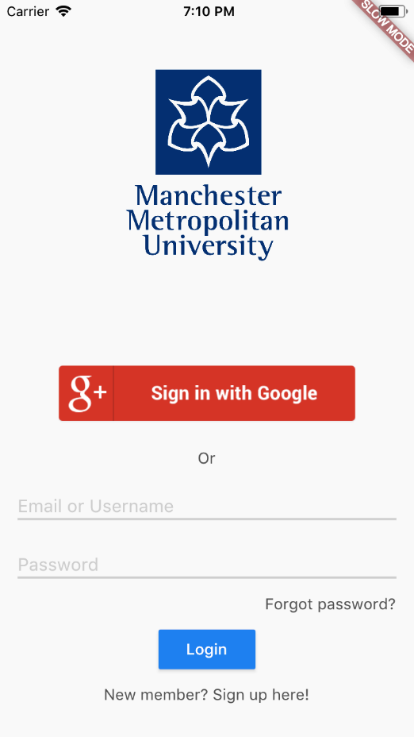

# Cross-Platform Social App

This project was made so that I can practise some Dart and Flutter. The application utilises Firebase for the backend. It contains a login page, account-creation page, sessions, login with Google feature, and a simple timeline.

